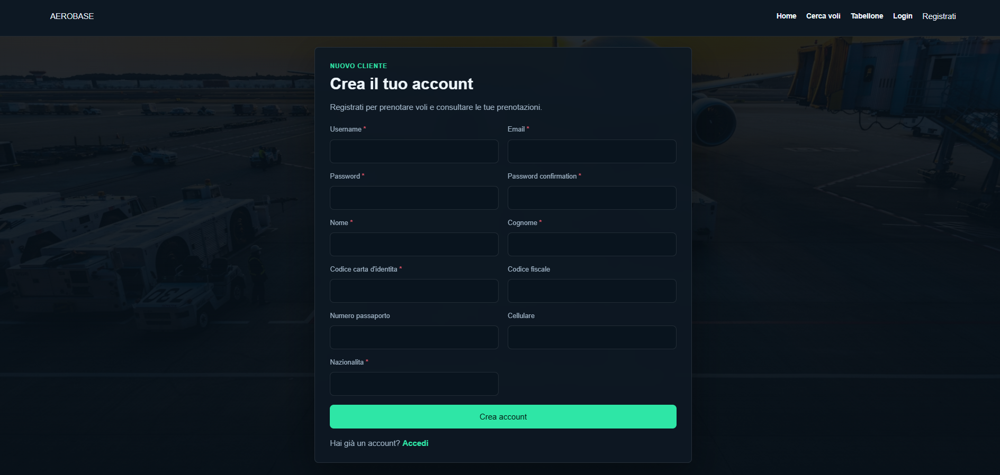

# AeroBase

AeroBase è un progetto universitario di Basi di Dati sviluppato con Django e MySQL.

Il sistema simula una piattaforma aeroportuale per la ricerca e prenotazione dei voli da parte dei passeggeri e per la gestione operativa da parte dello staff aeroportuale.

---

## Obiettivo del progetto

AeroBase non è pensato soltanto come un sito di acquisto biglietti, ma come una piccola piattaforma gestionale aeroportuale.

I passeggeri possono registrarsi, cercare voli, acquistare biglietti dichiarando eventuali bagagli, simulare un pagamento e visualizzare lo stato dei voli tramite tabellone.

Parallelamente, gli operatori aeroportuali possono gestire voli, gate, bagagli e personale in base al proprio ruolo.

L'idea progettuale è quella di un servizio utilizzabile da più aeroporti: ogni operatore è associato a uno specifico aeroporto e può operare solo sui dati collegati al proprio scalo.

---

## Tecnologie utilizzate

- Python
- Django
- MySQL
- HTML
- CSS
- JavaScript
- draw.io

---

## Funzionalità principali

### Area pubblica

- Home page
- Ricerca voli per aeroporto di partenza, destinazione e data
- Tabellone voli aggiornato dinamicamente
- Registrazione cliente
- Login e logout

### Area cliente

- Prenotazione volo
- Scelta della classe
- Scelta del posto disponibile
- Dichiarazione bagagli
- Pagamento simulato
- Consultazione delle prenotazioni
- Modifica dei dati personali e documentali
- Visualizzazione di eventuali informazioni relative ai voli

### Area operatore

- Dashboard operatore
- Gestione voli: modifica di orari, ritardi, stato operativo e assegnazione di gate compatibili con il tipo di volo
- Verifica e aggiornamento bagagli dei clienti al check-in
- Gestione staff da parte dell'admin aeroportuale

---

## Struttura del database

Il database è realizzato in MySQL.

Le tabelle principali del progetto sono:

- `Aeroporto`
- `Aereo`
- `Gate`
- `Volo`
- `Volo_Nazionale`
- `Volo_Internazionale`
- `Compagnia_Aerea`
- `Operatore`
- `Bagaglio`
- `Passeggero`
- `Prenotazione`
- `Gestione_Volo`
- `Transazione`
- `Metodo_Pagamento`

Nel modello logico alcune relazioni sono implementate come tabelle, sia per consentirne il salvataggio sia perché contengono dati propri:

- `Prenotazione` collega `Passeggero` e `Volo`, memorizzando anche posto, classe, data di acquisto e stato del pagamento;
- `Gestione_Volo` collega `Operatore` e `Volo`, registrando le modifiche operative effettuate sui voli.

Il progetto utilizza inoltre la tabella `auth_user`, generata da Django tramite `django.contrib.auth`, per la gestione dell'autenticazione e delle password hashate.

---

## Scelte progettuali principali

### Autenticazione

L'autenticazione non è stata sviluppata da zero, ma utilizza il sistema già fornito da Django tramite `django.contrib.auth`.

Le credenziali degli utenti sono salvate nella tabella `auth_user`, mentre le tabelle `Passeggero` e `Operatore` contengono solo i dati applicativi del progetto.

Il collegamento tra `auth_user` e le tabelle del dominio avviene tramite il campo `id_user`, con una relazione uno-a-uno.

### Ruoli operatori

Gli operatori possono avere ruoli differenti:

- `admin`
- `operatore_voli`
- `operatore_bagagli`

Ogni ruolo può accedere solo alle funzionalità previste.

### Voli nazionali e internazionali

La tabella `Volo` contiene i dati comuni a tutti i voli, a cui sono legate due tabelle di specializzazione: `Volo_Nazionale` e `Volo_Internazionale`.

Questa scelta permette di separare:

- informazioni comuni a tutti i voli;
- informazioni specifiche dei voli nazionali;
- informazioni specifiche dei voli internazionali.

Nel modello concettuale la specializzazione è totale e disgiunta: ogni volo deve essere nazionale oppure internazionale e non può appartenere a entrambe le categorie.

A livello fisico, la disgiunzione viene rafforzata tramite trigger MySQL che impediscono l'inserimento dello stesso volo in entrambe le sottotabelle e controllano la coerenza con il campo `Volo.tipo_volo`.

La totalità viene invece rispettata dal flusso applicativo/procedurale, inserendo sempre il record in `Volo` e il corrispondente record in `Volo_Nazionale` o `Volo_Internazionale`, preferibilmente nella stessa transazione.

### Gate e compatibilità

Ogni gate appartiene a un aeroporto.

I gate possono essere associati a un terminal, a un'area di imbarco e possono essere marcati come compatibili con voli internazionali.

Lato Django, quando un operatore modifica un volo, vengono mostrati solo i gate compatibili con il tipo di volo e con l'aeroporto dell'operatore.

### Bagagli

I bagagli vengono dichiarati dal passeggero durante la prenotazione.

In fase iniziale il bagaglio può non avere ancora peso e operatore associato; questi dati vengono aggiunti successivamente dall'operatore bagagli durante il check-in.

### Vincoli

Il database utilizza:

- chiavi primarie;
- chiavi esterne;
- vincoli `UNIQUE`;
- vincoli `CHECK`;
- campi `ENUM`;
- trigger sulle specializzazioni di `Volo`;
- politiche `ON DELETE CASCADE`;
- politiche `ON DELETE SET NULL`;
- indici per ottimizzare alcune query.

Le logiche più dinamiche, come scelta posto, gestione pagamento, aggiornamento stato voli e controllo ruoli, sono gestite lato Django.

---

# Installazione del progetto

## Clonare il repository

```bash
git clone https://github.com/martilumastro/aerobase.git
```

## Accedere alla cartella del progetto

```bash
cd aerobase
```

## Creare l'ambiente virtuale

```bash
python -m venv venv
```

## Attivare l'ambiente virtuale

### Linux / WSL

```bash
source venv/bin/activate
```

### Windows PowerShell

```bash
venv\Scripts\Activate.ps1
```

## Installare le dipendenze

```bash
pip install -r requirements.txt
```

## Configurare il database

Configurare il database MySQL nel file `settings.py` oppure tramite variabili d'ambiente.

## Eseguire le migrazioni Django

```bash
python manage.py migrate
```

## Avviare il server

```bash
python manage.py runserver
```

Il sito sarà disponibile all'indirizzo:

```text
http://127.0.0.1:8000/
```

---

# Importazione del database

Il progetto include un dump MySQL del database.

Esempio di importazione:

```bash
mysql -u nome_utente -p nome_database < aerobase_dump.sql
```

---

# Esempi SQL per popolamento database

Gli esempi seguenti mostrano un popolamento minimo ma coerente delle principali tabelle applicative.

Per gli utenti viene inserito un record in `auth_user` perché `Passeggero` e `Operatore` sono collegati all'utente Django tramite `id_user`.

> Nota: le password inserite via SQL con valore `!` non sono utilizzabili per il login. Per usare gli utenti demo, dopo l'importazione eseguire il comando indicato nella sezione **Utenti di test**.

```sql
USE aerobase;

-- Aeroporti
INSERT INTO Aeroporto (codice_iata, nome_aeroporto, citta, nazione, codice_icao)
VALUES
('BRI', 'Bari Karol Wojtyla', 'Bari', 'Italia', 'LIBD'),
('BDS', 'Brindisi Salento', 'Brindisi', 'Italia', 'LIBR'),
('ZRH', 'Zurigo Kloten', 'Zurigo', 'Svizzera', 'LSZH');

-- Compagnia aerea
INSERT INTO Compagnia_Aerea (codice_vettore, nome_compagnia, nazione)
VALUES
('DLH', 'Lufthansa', 'Germania');

-- Aereo
INSERT INTO Aereo (id_aereo, modello, capacita_passeggeri, codice_vettore)
VALUES
(20, 'Airbus A321', 220, 'DLH');

-- Gate
INSERT INTO Gate (codice_gate, codice_aeroporto, terminal, internazionale, area_imbarco)
VALUES
('BRI-A01', 'BRI', 'T1', 0, 'Area A'),
('BRI-B02', 'BRI', 'T1', 1, 'Area B');

-- Utenti Django di appoggio per passeggero e operatori
INSERT INTO auth_user (
  id, password, last_login, is_superuser, username,
  first_name, last_name, email, is_staff, is_active, date_joined
)
VALUES
(20, '!', NULL, 0, 'cliente_demo', '', '', 'cliente.demo@aerobase.it', 0, 1, NOW()),
(21, '!', NULL, 0, 'admin_demo', '', '', 'admin.demo@aerobase.it', 0, 1, NOW()),
(22, '!', NULL, 0, 'voli_demo', '', '', 'voli.demo@aerobase.it', 0, 1, NOW()),
(23, '!', NULL, 0, 'bagagli_demo', '', '', 'bagagli.demo@aerobase.it', 0, 1, NOW());

-- Passeggero
INSERT INTO Passeggero (
  username, nome, cognome, email, numero_passaporto,
  cellulare, nazionalita, id_user, codice_carta_identita, codice_fiscale
)
VALUES
('cliente_demo', 'Mario', 'Rossi', 'cliente.demo@aerobase.it', 'YA1234567',
 '3331112222', 'Italiana', 20, 'CA1234567', 'RSSMRA01A01H501U');

-- Operatori
INSERT INTO Operatore (
  codice_operatore, nome, cognome, email, cellulare,
  ruolo, codice_aeroporto, id_user
)
VALUES
('ADM-BRI', 'Admin', 'Bari', 'admin.demo@aerobase.it', '3000000101', 'admin', 'BRI', 21),
('VOL-BRI', 'Operatore', 'Voli', 'voli.demo@aerobase.it', '3000000102', 'operatore_voli', 'BRI', 22),
('BAG-BRI', 'Operatore', 'Bagagli', 'bagagli.demo@aerobase.it', '3000000103', 'operatore_bagagli', 'BRI', 23);

-- (...continua con tutto il blocco SQL esattamente come nel tuo testo...)
```

---

# Trigger specializzazioni Volo

I trigger seguenti rafforzano la coerenza delle specializzazioni di `Volo`.

Impediscono che lo stesso volo sia contemporaneamente nazionale e internazionale e verificano che la sottotabella scelta sia coerente con `Volo.tipo_volo`.

```sql
DROP TRIGGER IF EXISTS trg_vn_before_insert;
DROP TRIGGER IF EXISTS trg_vi_before_insert;

DELIMITER //

CREATE TRIGGER trg_vn_before_insert
BEFORE INSERT ON Volo_Nazionale
FOR EACH ROW
BEGIN
  ...
END//

CREATE TRIGGER trg_vi_before_insert
BEFORE INSERT ON Volo_Internazionale
FOR EACH ROW
BEGIN
  ...
END//

DELIMITER ;
```

---

# Utenti di test

I passeggeri hanno la possibilità di registrarsi in autonomia al sito, operazione obbligatoria per procedere con la prenotazione di un volo.

Per quanto riguarda gli operatori questa operazione non è prevista: nuovo personale può essere aggiunto solo da un admin aeroportuale.

## Credenziali demo consigliate per test

| Ruolo | Username | Password |
|---------|----------|----------|
| Admin aeroportuale | admin_demo | AdminDemo123! |
| Operatore voli | voli_demo | VoliDemo123! |
| Operatore bagagli | bagagli_demo | BagagliDemo123! |
| Cliente | cliente_demo | Test12345! |

Se gli utenti sono stati creati tramite gli esempi SQL precedenti, è necessario impostare le password con Django:

```bash
python manage.py shell -c "from django.contrib.auth.models import User; credenziali = {'admin_demo': 'AdminDemo123!', 'voli_demo': 'VoliDemo123!', 'bagagli_demo': 'BagagliDemo123!', 'cliente_demo': 'ClienteDemo123!'}; [u.set_password(p) or u.save() for u, p in ((User.objects.get(username=username), password) for username, password in credenziali.items())]"
```

---

# Galleria

<table>
  <tr>
    <td align="center"><b>Home Page</b><br></td>
    <td align="center"><b>Pagina Login</b><br></td>
  </tr>
  <tr>
    <td align="center"><b>Registrazione</b><br></td>
    <td align="center"><b>Cerca Voli</b><br></td>
  </tr>
  <tr>
    <td align="center"><b>Pagina Ricerca Voli</b><br></td>
    <td align="center"><b>Lista Voli Disponibili</b><br></td>
  </tr>
  <tr>
    <td align="center"><b>Pagina Scelta Posti</b><br></td>
    <td align="center"><b>Conferma Posto</b><br></td>
  </tr>
  <tr>
    <td align="center"><b>Pagina Metodo di Pagamento</b><br></td>
    <td align="center"><b>Profilo Cliente</b><br></td>
  </tr>
  <tr>
    <td align="center"><b>Modifica Profilo Cliente</b><br></td>
    <td align="center"><b>Gestione Admin</b><br></td>
  </tr>
  <tr>
    <td align="center"><b>Gestione Staff</b><br></td>
    <td align="center"><b>Gestione Voli / Modifica</b><br></td>
  </tr>
  <tr>
    <td align="center"><b>Gestione Operatore Voli</b><br></td>
    <td align="center"><b>Gestione Operatore Bagagli</b><br></td>
  </tr>
  <tr>
    <td align="center"><b>Gestione Bagagli</b><br></td>
    <td align="center"><b>Profilo Operatore</b><br></td>
  </tr>
</table>

---

# Struttura generale del progetto

```text
aerobase/
├── aerobase_project/
├── gestionale/
│   ├── static/
│   ├── templates/
│   ├── models.py
│   ├── views.py
│   ├── forms.py
│   └── urls.py
├── aerobase_dump.sql
├── manage.py
└── README.md
```

---

# Note

- Il pagamento presente nel progetto è simulato e non utilizza gateway reali.
- Il tabellone voli usa JavaScript per interrogare periodicamente un endpoint Django e aggiornare i dati visualizzati.
- Il progetto è stato realizzato per finalità universitarie nell'ambito del corso di Basi di Dati.
- Il diagramma E-R è stato realizzato con draw.io ed è incluso nel repository.
- La cartella docs contiene la documentazione e la presentazione PowerPoint del progetto